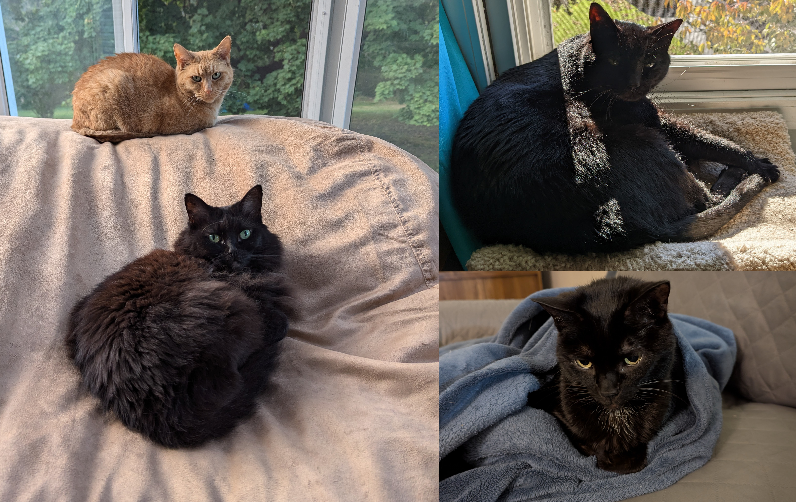

+++
title = "About"
weight = 0
+++

I, Michael Marvin (magico13), am a software engineer in Rochester, NY working full-time as a .NET and Azure developer for Wegmans Food Markets on the Meals2Go platform as the payment systems SME. In my free time I like to tinker with "maker" projects through 3d printing and Arduino, drive EVs, refine my Home Assistant setup, develop the [Emporia Vue integration for Home Assistant](https://github.com/magico13/ha-emporia-vue), and play video games (with the occasional mod development thrown in). My programming languages of choice are C# and Python. My games of choice tend toward Kerbal Space Program, Minecraft, Portal, and various simulation games. I am self-taught in programming, first learning Java for making Minecraft mods and later C# for Kerbal Space Program mods (I am the author of [Kerbal Construction Time](https://github.com/magico13/KCT) and [StageRecovery](https://github.com/magico13/StageRecovery)) but have been working professionally in C# since 2016.

I have a Bachelors of Science in Physics from Kent State University and a Masters of Science in Materials Science and Engineering from the University of Illinois at Urbana-Champaign. At UIUC I studied computational polymer physics in the Sing lab, focusing on single chain block copolymers in flow and developing new methods for hydrodynamic pre-averaging in Brownian dynamics simulations under flow.

Originally from Cleveland, OH, I moved with my wife and our four cats to Rochester in 2020 and have been enjoying the area ever since.

