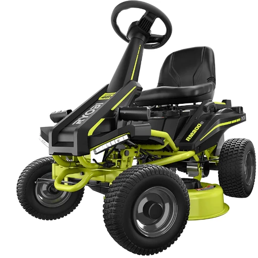
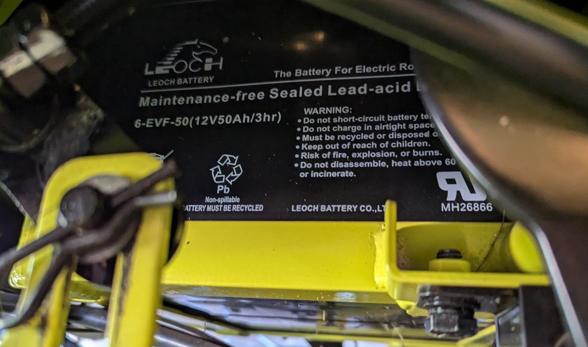
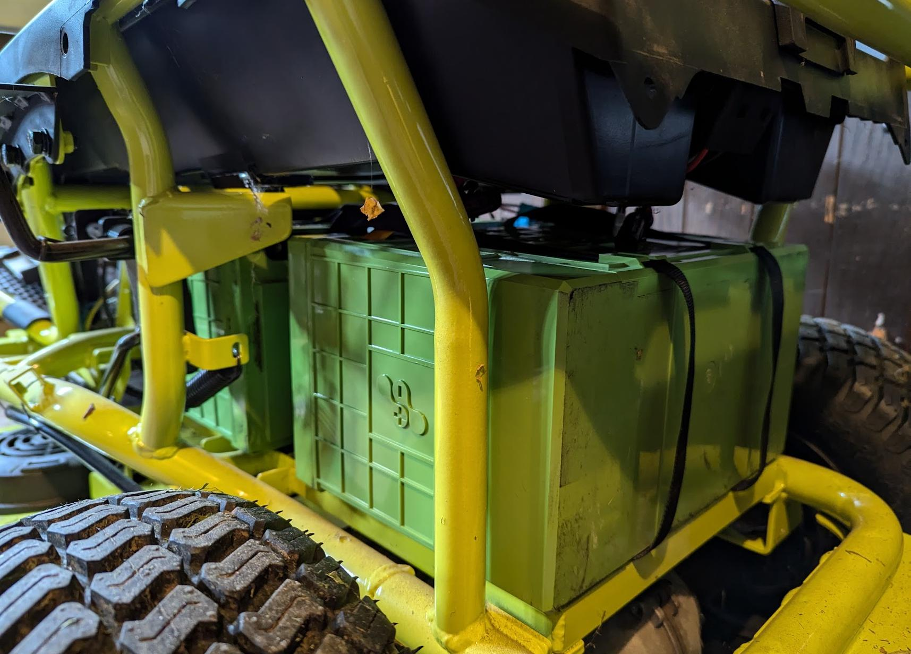
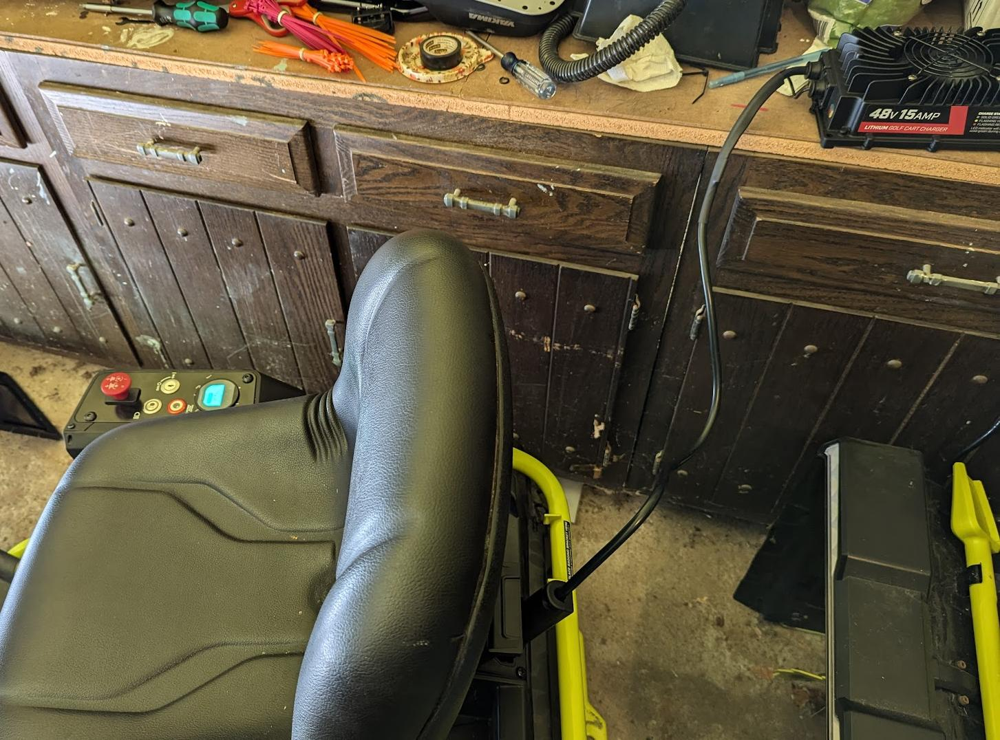
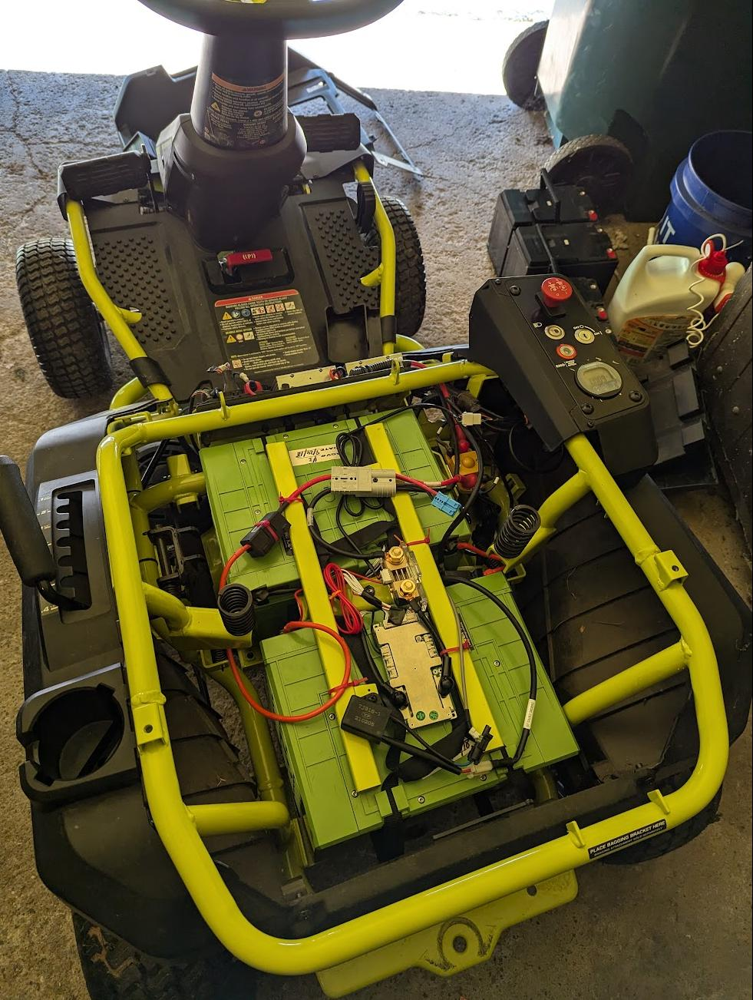

+++
title = "Ryobi Mower Lithium-Iron/LiFePO4 Battery Conversion"
draft = false
+++

## The Problem

We have a Ryobi RM300e series riding mower, model RY48130, which comes with lead acid batteries that don't hold up for long, especially after they've been run down to empty. While ours held up just fine for several years, easily mowing our roughly half acre from 2021 until 2024 without issue, we forgot to plug it in after a mow and it was inadvertently run to empty during the next use. This unfortunately severely damaged the capacity of the batteries, now they would start to give up half way through a mow, and there wasn't enough power to climb the hill in our yard.

## The Solution

There's a reason that no modern electric vehicle uses lead-acid batteries:

- they're *heavy*
- low energy density both by weight and volume
- cannot be discharged more than 50% without permanent damage
- they experience power sags under load and especially at low states of charge

Lithium-ion batteries are definitely the way to go to eliminate all of those problems, except they have their own downsides:

- infamously volatile chemistry (ie flammable)
- voltages don't line up with lead-acid batteries
  - 3.0V empty, 3.7V nominal, 4.2V full per cell. 3S is 9-12.6V: too low. 4S is 12-16.4V: too high.
- limited cycle life (ie recharges)

Which brings us to a third option: **Lithium Iron Phosphate (LiFePO4 or lithium-iron) batteries**

- heavier than lithium-ion, but much lighter than lead-acid for the same energy
- can still be discharged fully
- steady voltage until empty and no loss of power until they're completely drained
- voltage aligns with lead-acid batteries very well
  - 2.5V empty, 3.2V nominal, 3.4V full per cell. 4S is 10V to 13.6V
- considerably higher cycle life
- much more stable chemistry

The reduction in energy density is why top of the line EVs don't tend to use lithium-iron batteries, but they're becoming quite common in the lower range battery variants where they need less energy in the same amount of space. For the purposes of swapping from lead-acid to something better, they're nearly perfect as they can provide more energy, less weight, and voltages in line with what the rest of the circuits (ie motors, protection systems) expect. Because of this, you'll see tons of people swapping their lead-acid Ryobi batteries out for lithium-iron. They're the obvious choice.

## The Plan

Since lithium-iron batteries are clearly better and they have compatible voltages, surely you can just rip out the old batteries and put these new ones in and call it a day? Well, unfortunately it's not *that* easy...

For one, lithium-iron batteries don't charge with the same charging profile as lead-acid, so we need a new charger. And lead-acid batteries can self-balance their voltages, but lithium-iron batteries need a battery management system (BMS) to prevent over/under-charging and to balance the cells. They also don't discharge the same way; for lead-acid the voltage drops consistently as the battery discharges and so you can use that to gauge how empty they are, but for lithium-iron the voltage is pretty constant until they're dead, so the existing battery gauge is useless for knowing how much charge you've used and how much you've got left.

So our shopping list looks like this:

- 48 volts of LiFePO4 batteries that fit in the existing battery compartment
- BMS to protect the batteries
- New battery level gauge
- New charger specifically built for LiFePO4 batteries
- All the wires, fuses, connectors, etc to wire it all together

## The Batteries and BMS

The most important part of this project is picking the batteries. The old batteries were four 12V 50Ah lead-acid batteries arranged in series to give 48V and theoretically 2.4kWh of capacity. But since we can really only discharge down to half, it's more like 1.2kWh of total capacity.

So our target is a combined pack in 16S configuration with ideally at least 25Ah of total capacity to match what we could get out of the old pack. But ideally we can increase our total battery capacity and stay within the space constraints of the old battery compartment since these new ones should be more energy dense.

You can of course buy new batteries from Amazon or a dedicated battery site, looking currently it seems to be about $60 for a single 12V 25Ah battery, but I wanted to try to save a bit of money and also reuse batteries that had been pulled out of service elsewhere, so I turned to batteryhookup.com to see what I could find. I am not affiliated with them and I am not being paid to mention them but if you want to get batteries pulled from elsewhere and give them new purpose, they're definitely worth checking out.

The batteries I ended up finding were two [Valence U27-24XP](https://www.lithionbattery.com/wp-content/uploads/2019/12/Valence-U27-24XP-Data-Sheet-210623.pdf) batteries, which I would link up with a 16S BMS (the [7-17S LiFePO4 + CAN + RS485 from their site](https://batteryhookup.com/products/12v-lifepo4-smart-bms-w-low-temp-cutoff)). Rather than four 12V batteries I opted for two 24V batteries since that reduced the space lost due to extra casing and simplified the wiring. These batteries are significantly more capacity, 72Ah when new, giving over 1.8kWh *each* for 3.6kWh total. That's about **three times** what we were targeting, which should give us a pretty significant boost in mowing time even if they're not at full capacity anymore. We'd need 12 of those $60 batteries mentioned before to reach similar levels, over $700, but these used ones cost $170 each for $340 total (before the 5% off coupon).

They're just a little too big to fit inside the battery trays, but they can still fit on their sides and be held down by the original retaining bar. The circuit boards inside the batteries aren't helpful, but the balance leads are all broken out into a connector that fits a standard pitch male header, so we can devise a simple system to hook up the BMS to the balance leads without having the crack open the shell of the batteries.

## Battery Gauge

There are plenty of options out there on Amazon and elsewhere for battery monitors designed to work with lithium-iron batteries. The key thing is that they need to have a current measuring device placed in the circuit so they can do "Coulomb counting", which is just a fancy way of saying that they count how many amp-hours have been used since they last reset. The one I have, the [CAMWAY 500A](https://www.amazon.com/dp/B088RG27LS), is a higher amp rating than needed and that also means the current sensor is quite large, but it seems to be working just fine. The bigger problem is that the gauge part needs a larger diameter hole than the old gauge and that part of the mower is a steel plate. I ended up grinding the hole larger with a dremel and several cutting discs, which worked but was messy and frankly the most dangerous part of the whole project. If you can, find one that fits in the existing hole!

Technically this is an optional component. The BMS will prevent discharging the battery too far, but will do so without any warning. The mower will suddenly shut off and you will not be able to drive it back to recharge it. However, if your BMS supports Bluetooth or similar, you could use your phone to monitor the battery level. If you know that you'll never actually drain the battery too low, which could be likely if you increase the capacity as much as I did, then you can get by just fine without any external battery monitor at all!

## Replacement Charger

The charger that comes with the mower is designed for lead-acid batteries, and while it may work ok with the replacement batteries for a while, it won't really charge them properly. For that we want a charger designed specifically for lithium-iron phosphate batteries.

The triangle plug used by the mower is pretty much the same as one used by some golf cart brands, so you can find chargers online that should work with light modifications. What I opted for instead is getting an "onboard" charger and taking the plug off of the old charger and attaching it instead. That way I don't need to modify the plug, and the [charger I got](https://www.amazon.com/dp/B0BQZ2LV9N) is made by an American company and seemed more reliable than the others I was looking at.

## Wrap Up

Here's an image from when just about everything was in place. The actual process of pulling out the old batteries and wiring up the new ones in their place is fairly straightforward, just make sure to follow the instructions for your BMS and battery gauge and any other components you have installed. I plan on making a follow up post on how to interact with this particular BMS over RS485 if you want to monitor voltages or modify the BMS settings at all. The batteries have really brought new life to the mower and I am hoping they will continue to work well for the life of the mower. I may need to go back and 3d print some custom mounts to ensure nothing can move, check on the zip ties that I used for cable routing to ensure they're not degrading, and double check that all the connections are secure, but those checks will be something I do before the first mow this season. Given that it's currently snowing, I still have some time before that's needed!

This blog doesn't have comments but if you find this and have any questions, my email is not hard to find if you look at my github profile. Good luck with your projects!
